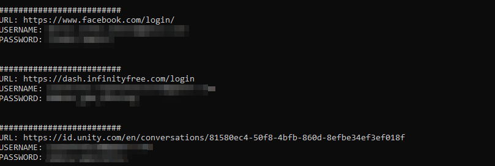

# ChromeRaptor



Un Simple extractor de credenciales para navegador Chrome para propositos educativos ;)

## Dependencias para la ejecucion del Script

```bash
pip install pycryptodome
pip install pywin32
```

Testeado en Windows 10-11. El metodo para descifrar las credenciales del navegador solo funcionar en versiones < 80
